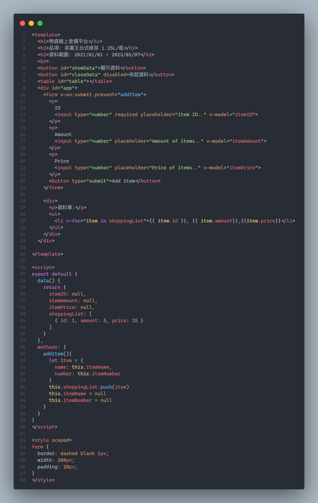
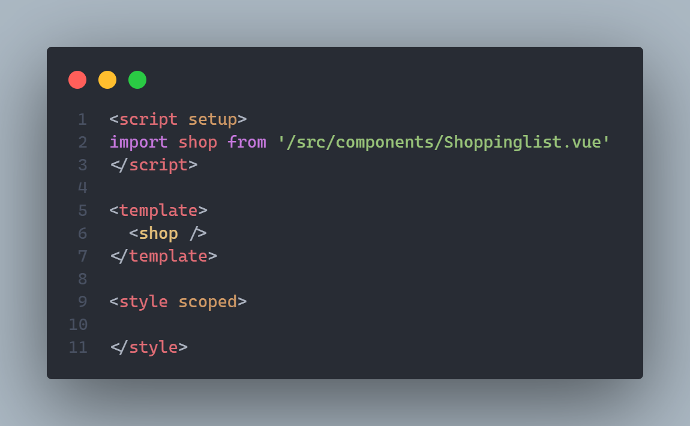
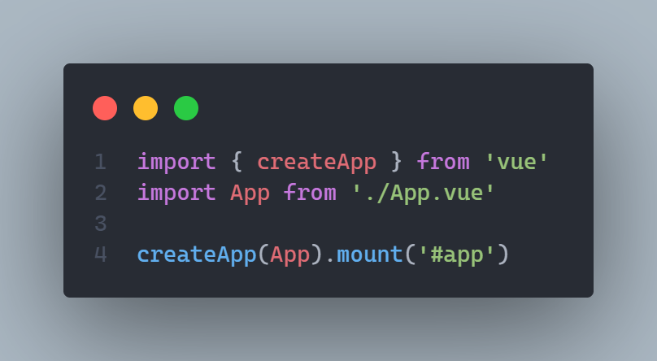
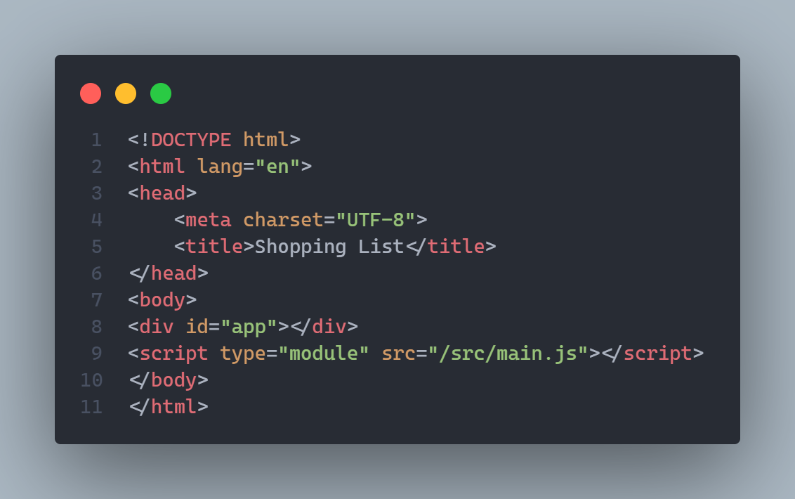
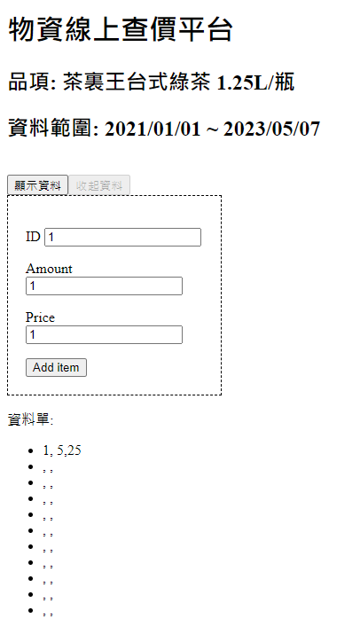

# 作業5 單一檔案元件 SFCs

`
姓名: 張牧翔
學號: D1035899
`

- 使用作業: [作業4 通貨膨脹-你關心缺蛋嗎?](https://d1035899.github.io/HW4/public/html/table.html)
- 說明網站: [https://github.com/D1035899/HW5/blob/master/README.md](https://github.com/D1035899/HW5/blob/master/README.md)
- Code Repo: [https://github.com/D1035899/HW5](https://github.com/D1035899/HW5)

---

## 目錄

- [作業5 單一檔案元件 SFCs](#作業5-單一檔案元件-sfcs)
  - [目錄](#目錄)
  - [元件介紹](#元件介紹)
    - [Shoppinglist.vue](#shoppinglistvue)
    - [App.vue](#appvue)
    - [main.js](#mainjs)
    - [inndex.html](#inndexhtml)
  - [網頁展示](#網頁展示)
  - [心得](#心得)

---

## 元件介紹

### Shoppinglist.vue

### App.vue

### main.js

### inndex.html

---

## 網頁展示

>因為不太熟悉，所以不知道怎麼透過add item按鈕加入資料，本來以為是沒問題的

---

## 心得

這次的vueJS實作我覺得蠻有趣的，因為vue可以把一個網頁拆成一塊一塊的元件，如此一來就能方便的import這些網頁code，既省時又方便。原本想要用在釣魚復刻網站，但是最近有太多專題要忙了，所以只好用HW4來寫。一開始以為vue很簡單，但實際上寫起來還是有點複雜，因為思考思維不太一樣，希望日後能夠更加熟悉
